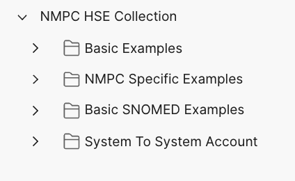
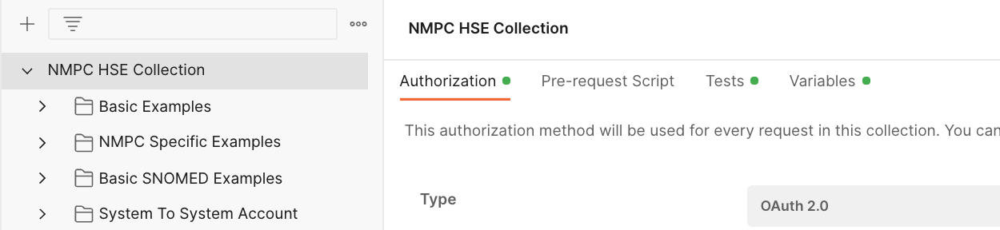
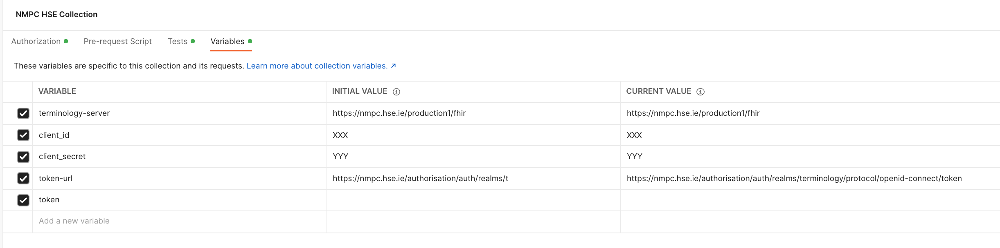
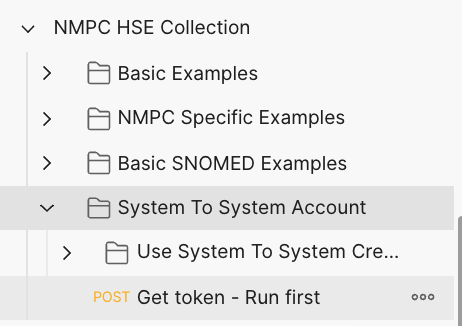

# National Medicinal Product Catalogue (NMPC) API Examples

This repository aims to provide a library of useful examples to help users of the NMPC become more familiar with the basic functions and operations of the APIs that enable querying and accessing the catalogue . It should be used in conjunction with the documentation provided in the [terminology module of the FHIR standard](https://www.hl7.org/fhir/terminology-module.html) and the [National Medicinal Product Catalogue Information](https://about.hse.ie/our-work/technology/national-medicinal-product-catalogue-nmpc/).

# Postman
* [Postman](https://www.postman.com/downloads/) is a freely available api tool that can be useful for exploring the FHIR apis that the Terminology Server exposes but all the examples are also provided as codesnippets in various languages (including curl).
* [Import the Postman collection](https://learning.postman.com/docs/getting-started/importing-and-exporting-data/#importing-data-into-postman)

# Examples structure
The Postman examples are organised into folders:

 

# Authentication
The NMPC APIs are secured using OAuth2 and require a standard `Authorization` header to be sent with the requests containing a Bearer token. The examples in all the folders (except from the one labelled `System to System Account`) have been configured to use a `User Account` to obtain the token for access. The Postman Collection is configured to cache an access token in the `token` environment variable so that once a token has been obtained - this token is used by the other requests in the collection.

# Obtaining a token (User Account)
* Select the parent folder of the collection "NMPC HSE Collection"

* Click the Orange Button labelled `Get New Access Token`

* A window will pop up asking for your login credentials - complete them and login
* Click Orange `Use Token` button
* Run example requests

# Obtaining a token (System Account)
* Select the parent folder of the collection "NMPC HSE Collection"

* Select the variables tab

* Set the two placeholder variables for your credentials (`client_id` and `client_secret`) with your system credentials.
* Send the `Get Token` request 

* Run example requests